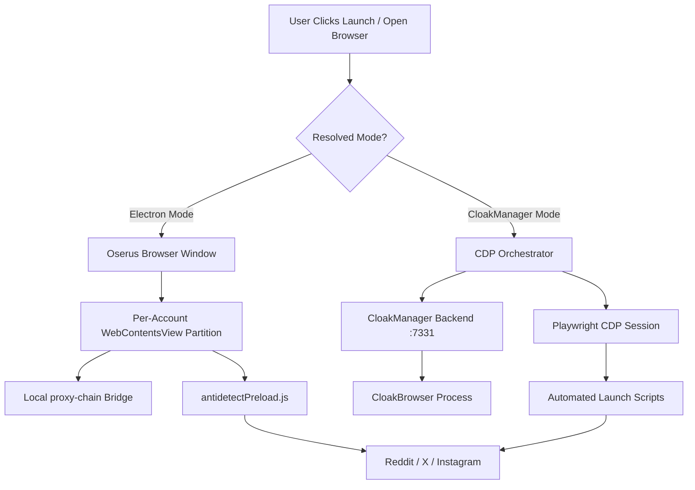
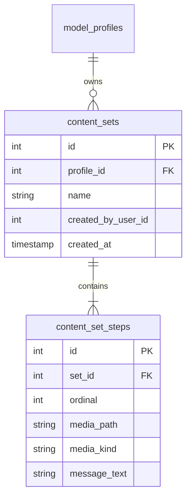

# Oserus Management — Complete Technical Handoff Document

**Version:** 0.86.12  
**Repository:** `Valkine/Oserus-reddit` (mirrored from `Gee2424/Oserus-reddit`)  
**Application ID:** `com.oserus.management`  
**Target Platform:** Windows x64 (NSIS Desktop Application)

---

## Table of Contents
1. [Executive Summary](#1-executive-summary)
2. [Tech Stack & Dependencies](#2-tech-stack--dependencies)
3. [Repository Structure & Codebase Map](#3-repository-structure--codebase-map)
4. [Main Process Architecture (`src/main/`)](#4-main-process-architecture-srcmain)
5. [Anti-Detect Browser & Dual Engine (`browser.js` & CloakManager)](#5-anti-detect-browser--dual-engine)
6. [Chrome DevTools Protocol (CDP) & Playwright Engine (`src/main/cdp/`)](#6-chrome-devtools-protocol-cdp--playwright-engine)
7. [Automation, Autopilot & Coordinator (`services/`)](#7-automation-autopilot--coordinator)
8. [Scripts & Content Sets Feature](#8-scripts--content-sets-feature)
9. [Supabase Cloud Sync & Multi-Installation Team Model](#9-supabase-cloud-sync--multi-installation-team-model)
10. [Local Database & Security (`db.js` & `credential_vault`)](#10-local-database--security)
11. [Role-Based Access Control (RBAC) & Permissions](#11-role-based-access-control-rbac--permissions)
12. [Renderer Architecture & UI Pages (`src/renderer/`)](#12-renderer-architecture--ui-pages)
13. [Build, Packaging & CI/CD Release Pipeline](#13-build-packaging--cicd-release-pipeline)
14. [Operational Playbook & Key Configuration](#14-operational-playbook--key-configuration)

---

## 1. Executive Summary

**Oserus Management** is an enterprise-grade desktop management suite tailored for multi-account social media operations (Reddit, X / Twitter, Instagram, TikTok, RedGifs, and OnlyFans). It unites:

- **Isolated Anti-Detect Browsing:** A customized Chromium / Electron browser window using native `WebContentsView` partitions (per account) and an integrated **CloakManager / CloakBrowser** CDP engine that resists browser fingerprinting, prevents IP/WebRTC leaks, and maintains isolated cookie/storage jars.
- **Automated Farming & Engagement:** Human-like scrolling, liking, following, viewing, and AI-assisted commenting with configurable pacing, quiet hours, and persona styles.
- **Posting & Scheduling Hub:** Calendar/Kanban-based scheduling (Scheduler Pro), automated post generation via LLM cascade (Claude, Grok, OpenAI), and distributed cross-machine coordination.
- **Chatter Scripts System:** Reusable, structured content "Sets" and "Steps" (media + text) that model chatters can deploy sequentially in live chats to preserve brand consistency.
- **Multi-Tenant Cloud Sync:** Backed by Supabase Postgres with Realtime presence, distributed task locking (`post_locks`), machine tracking, and local OS keychain credential encryption (`safeStorage`).

---

## 2. Tech Stack & Dependencies

| Layer | Technologies | Purpose |
|---|---|---|
| **Runtime & Shell** | Electron 32.1.2, Node.js 22 | Desktop application runtime and OS integration |
| **Frontend Framework** | React 18.3.1, Vite 5.4.8 | High-performance single-page app (SPA) UI |
| **Local Database** | `better-sqlite3` 11.3.0 (WAL mode) | Low-latency local cache, protocol storage, and session registry |
| **Cloud Synchronization** | `@supabase/supabase-js` 2.107.0 | Team sync, Postgres RLS, Realtime presence, and distributed locks |
| **Browser Automation & CDP** | Playwright 1.48.0, `ws` 8.21.0 | CloakBrowser automation, script execution, and CDP orchestration |
| **Proxy & Network Guard** | `proxy-chain` 2.7.1, `socks` 2.8.9 | Local HTTP-to-upstream proxy bridge, SOCKS5 auth, and IPv4 bridge |
| **Security & Passwords** | Electron `safeStorage`, `bcryptjs` 2.4.3 | OS-level credential encryption (DPAPI on Windows, Keychain on macOS) |
| **Auto-Updating** | `electron-updater` 6.3.9, `electron-log` | Background check, delta download, and restart-to-install |

---

## 3. Repository Structure & Codebase Map

```
Oserus-reddit/
├── .github/workflows/
│   └── release.yml          # GitHub Actions workflow: builds Windows NSIS exe + bundles backend
├── build/                   # Icons, bundled backend binaries, and build resources
├── docs/                    # Architecture diagrams and specifications
├── src/
│   ├── main/                # Electron Main Process
│   │   ├── cdp/             # Playwright/CDP connection manager & script orchestrator
│   │   ├── cdp-scripts/     # Automated browser tasks (login, cookies, compose, inbox)
│   │   ├── ipc/             # 35 modular IPC handler files
│   │   ├── lib/             # Helper utilities (assignments, browser modes, retry)
│   │   ├── platforms/       # Platform adapters (Reddit, X, Instagram, TikTok)
│   │   ├── services/        # Background coordinators, proxies, AI generation, topic discovery
│   │   ├── sync/            # Supabase Postgres schema, synchronization, and Realtime presence
│   │   ├── antidetectPreload.js # Preload injected into browser partitions to spoof navigator/hardware
│   │   ├── autofill.js      # In-page credential injection script builder
│   │   ├── browser.js       # Standalone Oserus Browser window manager (WebContentsView based)
│   │   ├── cloakmanager.js  # REST + WebSocket client for CloakManager backend (127.0.0.1:7331)
│   │   ├── db.js            # SQLite database initialization, schema, migrations, and credential vault
│   │   ├── fingerprint.js   # OS profile generation and canvas/webgl noise generator
│   │   ├── index.js         # Main process entry point: lifecycle, window creation, auto-updater
│   │   ├── tray.js          # System tray icon and context menu
│   │   └── updater.js       # electron-updater configuration
│   ├── preload/             # Electron Preload Bridges
│   │   ├── index.js         # Exposes window.api to Management UI
│   │   ├── browser.js       # Exposes window.oserusBrowser to Oserus Browser Chrome UI
│   │   └── engagement.js    # Injected bridge for automated browser scrolling/actions
│   ├── shared/
│   │   └── permissions.js   # Single source of truth for 28+ RBAC permissions
│   └── renderer/            # React UI Frontend
│       ├── assets/          # Static logos and graphics
│       ├── browser/         # BrowserShell.jsx (frameless tab strip, omnibox, bookmarks, side panel)
│       ├── components/      # 22 reusable UI components (tables, drawers, panels, modals)
│       ├── hooks/           # Custom React hooks (useCloakManagerLaunch, etc.)
│       ├── lib/             # React contexts (Auth, Permissions, ActiveAccount, Toast, Confirm)
│       ├── pages/           # 19 feature pages (Dashboard, ModelDetail, Scripts, Team, etc.)
│       └── styles/          # global.css design tokens and styles
├── package.json             # Build configuration, npm scripts, and electron-builder setup
└── vite.config.js           # Vite development server and build config
```

---

## 4. Main Process Architecture (`src/main/`)

### 4.1 Entry Point (`index.js`)
- **Network & DNS Hardening:**
  Enforces strict anti-leak flags before `app.whenReady()`:
  - Disables non-proxied WebRTC UDP (`webrtc-ip-handling-policy: disable_non_proxied_udp`).
  - Disables QUIC protocol (`disable-quic`) to prevent UDP traffic leaking around TCP proxies.
  - Disables speculative DNS and prefetching (`AsyncDns`, `dns-prefetch-disable`, `no-pings`).
  - Forces IPv4 resolution order (`dns.setDefaultResultOrder('ipv4first')`).
- **Main Window Management:**
  Hosts the single-page management dashboard with native frameless styling and context isolation.
- **Pop-out Window Factory (`openPopout`):**
  Allows detaching any page (e.g. `#popout=inbox` or `#popout=scheduler`) into a standalone, always-on-top window while sharing state and storage.
- **IPC Registrations:**
  Bootstraps all 35 IPC modules across authentication, profiles, accounts, proxies, and automation.
- **CloakManager Backend Auto-Launcher:**
  In production builds (`app.isPackaged`), detects, spawns, and health-checks the bundled `ctrldlogin-backend-windows.exe` folder on a free local port, updates the client base URL, and binds the WebSocket.

### 4.2 IPC Subsystem (`src/main/ipc/`)
Every major domain is encapsulated in an isolated handler module:

| Module | Responsibilities |
|---|---|
| `accounts.js` | Social account CRUD, status lifecycle (`warming`, `ready`, `paused`, `banned`), proxy binding |
| `auth.js` / `teamAuth.js` | Operator login, token generation, session heartbeat, password changes |
| `automation.js` / `engagementRuns.js` | Managing and executing saved engagement presets |
| `autopilotProtocol.js` | Unified profile-level posting and commenting protocol settings |
| `cloakmanager.js` | Profile creation, status checking, binary updates, and launch retry |
| `cloud.js` | Supabase connection status, manual sync triggers, and peer diagnostics |
| `inbox.js` | Multi-account messaging aggregation, message polling, and sending |
| `intelligence.js` | Keyword search across platforms, content link harvesting, engagement statistics |
| `platforms.js` | Platform registry (Reddit, RedGifs, X, Instagram, TikTok, OnlyFans) |
| `posts.js` / `scheduled.js` | Immediate posting, post draft management, and Kanban scheduler |
| `profiles.js` | Model profiles CRUD, primary manager assignment, and proxy fallbacks |
| `proxies.js` | Proxy testing, latency checking, IP lookup, and credential masking |
| `roles.js` / `team.js` | Team members, invitation tokens, machine sessions, and permission overrides |
| `scripts.js` | Content Sets and ordered Steps (media upload + message text) |

---

## 5. Anti-Detect Browser & Dual Engine

The application supports **two distinct browser modes** per model or account:



### 5.1 Mode 1: Oserus Browser (Native Electron)
Implemented in `src/main/browser.js` and rendered via `src/renderer/browser/BrowserShell.jsx`:
- **Native `WebContentsView` Partitioning:** Each account runs in a discrete partition (`persist:<partition_key>`). Sessions never share cookies, localStorage, or caches.
- **Unified Multi-Tab Window (`openForModel`):** All accounts belonging to a model open in one window. Pinned tabs display the platform icon and username; tab clicks re-scope the active account dynamically.
- **Local Proxy Anonymization (`sessionPrep.js`):** Upstream SOCKS5 or HTTP/HTTPS proxies are routed through a local loopback bridge (`proxy-chain`), ensuring credentials never leak and proxy challenges are answered transparently.
- **Preload Spoofing (`antidetectPreload.js`):** Deep prototype patches for `navigator` (userAgent, platform, hardwareConcurrency, deviceMemory), `screen` (dimensions, colorDepth), `Intl.DateTimeFormat` (timezone), WebGL vendor/renderer strings, and audio buffer noise.
- **Embedded Side Panel:** Right-hand drawer providing quick access to Intelligence, Automation Runs, Inbox, Scheduler, and Scripts directly alongside the browsing session.

### 5.2 Mode 2: CloakManager (External Anti-Detect Engine)
Implemented in `src/main/cloakmanager.js` and `src/main/services/cloakManagerBinary.js`:
- Spawns the dedicated `ctrldlogin-backend-windows.exe` daemon.
- Connects via REST API (`/api/profiles`, `/api/launch`, `/api/running`) and WebSocket for real-time lifecycle notifications (`cdp_ready`, `profile_stopped`).
- Bundles full backend dependencies (DLLs and extension modules) within the application installer resources.
- Provides industrial-grade browser fingerprint isolation specifically tuned to evade modern anti-bot systems.

---

## 6. Chrome DevTools Protocol (CDP) & Playwright Engine (`src/main/cdp/`)

When running in CloakManager mode, Oserus drives browser automation via Chrome DevTools Protocol (CDP) using Playwright:

### Core Modules:
- **`orchestrator.js`:** Single owner of the launch lifecycle state machine:
  `idle` ➔ `launching` ➔ `warming` ➔ `cdp_connecting` ➔ `running_scripts` ➔ `ready` (or `failed`).
  Maintains a per-profile mutex (`withProfileLock`) so automation tasks (e.g. background comments) and manual launches never conflict on the same browser page.
- **`connection-manager.js`:** Pools and maintains live Playwright CDP connections to CloakBrowser instances, handling reconnects and health monitoring.
- **`script-discovery.js` & `script-executor.js`:** Discovers and executes task and setup scripts.

### Script Catalog (`src/main/cdp-scripts/`):
- **Launch Setup:**
  - `bookmarks.js`: Seeds the browser's bookmark bar with platform links.
  - `cookie-warmer.js`: Navigates to neutral sites to establish browsing history.
  - `environment.js`: Validates window bounds, timezone, and network viability.
  - `homepage-tiles.js`: Sets up initial new-tab tiles.
- **Authentication:**
  - `reddit-login.js`: Detects login state, enters credentials from vault, and verifies session cookies.
- **Tasks:**
  - `reddit/inbox-fetch.js`: Scrapes unread notifications and messages via CDP.
  - `reddit/inbox-reply.js`: Submits threaded comment replies or direct messages.
  - `reddit/submit.js`: Automates post submission with title, flair, and link/text bodies.
  - `x/compose.js`: Automates tweet creation on X.

---

## 7. Automation, Autopilot & Coordinator

### 7.1 Multi-Platform Posting Coordinator (`services/coordinator.js`)
- Runs as a persistent background timer checking for due posts.
- **Platform Separation:** Accounts are partitioned by platform (Reddit, X, IG, TikTok) to prevent cross-platform rate-limit interference.
- **Proxy Serialization:** Accounts sharing the same proxy execute serially to prevent burning residential IP addresses with concurrent requests.
- **Distributed Machine Lock:** Acquires a lock on `post_locks` via Supabase so multiple operator machines never post to the same account at the same time.
- **Remote Killswitch:** Listens to `machine_sessions.autopilot_enabled`. Team managers can remotely disable autopilot on any specific machine from the Team page.

### 7.2 Engagement Automation (`services/engagement.js` & `engagementRuns.js`)
- Simulates natural user sessions in hidden browser windows.
- Performs human-like scrolling, video watch durations, like probabilities, and follow actions.
- **AI Persona Commenting:** Generates contextual comments using AI personas (`curious`, `playful`, `flirty`, `dry`, or `custom`) powered by Claude, Grok, or OpenAI.
- **Runs Presets:** Saved presets stored in `engagement_runs` allow operators to configure standard engagement templates (e.g., "Aggressive Warmup", "Light Lurk").

---

## 8. Scripts & Content Sets Feature

Located in `src/renderer/pages/Scripts.jsx` and backed by `src/main/ipc/scripts.js`:



- **Purpose:** Solves the chatter coordination problem. Models often have specific paid content bundles (e.g., photo sets, striptease progressions) that chatters must deliver in an exact sequence with accompanying script text.
- **Structure:**
  - **Content Set:** Named collection belonging to a model (e.g., "Tease & Reveal Set").
  - **Content Steps:** Ordered items (`ordinal`) containing a local media asset (image/video stored in `userData/content_set_media/<set_id>/`) and corresponding text.
- **Access Control:** Scoped by model assignment (`canAccessProfile`). Chatters only see and deploy sets for models assigned to them.
- **Dual Display:** Built and managed on the standalone **Scripts Page**; viewed and executed step-by-step from the **Browser Side Panel**.

---

## 9. Supabase Cloud Sync & Multi-Installation Team Model

Designed in `Team_architecture.md` and implemented in `src/main/sync/supabase.js`:

### 9.1 Synchronized Tables
- `teams` & `team_members`: Organization hierarchy and membership.
- `account_assignments`: Maps operator user IDs to specific social accounts or models.
- `machine_sessions`: Registry of every installation, hostnames, and autopilot status.
- `post_locks`: Distributed locking mechanism preventing double-posting.
- `model_profiles`, `reddit_accounts`, `proxies`: Core social media management assets.
- `engagement_runs`, `content_sources`, `docs`: Shared operational templates.

### 9.2 Realtime Presence & Heartbeats
- Joins the Supabase Realtime channel `oserus:presence`.
- Emits a heartbeat every 15 seconds containing operator user ID, device hostname, active accounts, and app version.
- Allows team owners to see live operator activity and machine status in real time.

---

## 10. Local Database & Security (`db.js` & `credential_vault`)

### 10.1 SQLite Architecture
- Database file located at: `%APPDATA%\oserus-management\reddit-manager.db`.
- Configured with **Write-Ahead Logging (WAL)** (`journal_mode = WAL`) and foreign key constraints enabled for concurrent read/write stability.

### 10.2 Zero-Knowledge Credential Vault (`credential_vault`)
To prevent exposing sensitive social account passwords in cloud databases:
- Passwords for social accounts and proxies are **never written to Supabase in plaintext**.
- Stored locally in the `credential_vault` table.
- Encrypted using **Electron `safeStorage`**, which leverages Windows Data Protection API (DPAPI) or macOS Keychain.
- Each operator enters credentials once on their workstation, or pulls shared team credentials via authenticated end-to-end encryption.

---

## 11. Role-Based Access Control (RBAC) & Permissions

Defined in `src/shared/permissions.js`:

### Role Hierarchy
1. **Owner (`owner`):** Full system access, billing, team deletion, role editing.
2. **Admin (`admin`):** Full management access, member invitations, proxy configuration, AI settings.
3. **Manager (`manager`):** Model assignments, schedule coordination, script creation, team oversight.
4. **Chatter (`chatter`):** Restricted to assigned models; access to Inbox, Scripts viewer, and Browser.
5. **Virtual Assistant (`reddit_va` / `va`):** Restricted to assigned accounts; access to Scheduler, Autopilot, and Browser.

### Permission Mapping Matrix (Key Permissions)

| Permission Key | Description | Owner | Admin | Manager | Chatter | VA |
|---|---|:---:|:---:|:---:|:---:|:---:|
| `dashboard.view` | View command center | ✅ | ✅ | ✅ | ❌ | ❌ |
| `profiles.manage` | Create/edit model profiles | ✅ | ✅ | ✅ | ❌ | ❌ |
| `accounts.manage` | Link/delete social accounts | ✅ | ✅ | ✅ | ❌ | ❌ |
| `accounts.launch` | Open Oserus Browser | ✅ | ✅ | ✅ | Assigned | Assigned |
| `inbox.view` | Access messaging & direct messages | ✅ | ✅ | ❌ | Assigned | ❌ |
| `scripts.manage` | Build & edit content sets/steps | ✅ | ✅ | ✅ | ❌ | ❌ |
| `scripts.use` | View & deploy content steps | ✅ | ✅ | ✅ | Assigned | ❌ |
| `protocols.manage` | Edit autopilot & engagement runs | ✅ | ✅ | ✅ | ❌ | ❌ |
| `team.members` | Invite and remove team members | ✅ | ✅ | ❌ | ❌ | ❌ |
| `team.machines` | View & toggle remote autopilot | ✅ | ✅ | ✅ | ❌ | ❌ |
| `settings.edit` | Configure proxies & AI API keys | ✅ | ✅ | ❌ | ❌ | ❌ |

---

## 12. Renderer Architecture & UI Pages (`src/renderer/`)

### 12.1 State & Context Hierarchy (`App.jsx`)
```
AuthProvider
 └── PermissionsProvider
      └── ActiveAccountProvider
           └── ToastProvider
                └── ConfirmProvider
                     └── InboxLiveProvider
                          └── Shell (Sidebar + Page Content)
```

### 12.2 Page Guide

| Page | File | Purpose |
|---|---|---|
| **Dashboard** | `pages/Dashboard.jsx` | Command center: earnings metrics, active team members, quick scheduler, and live activity log |
| **Models** | `pages/Profiles.jsx` | Grid/list of all models with avatar, assigned accounts count, and quick launch |
| **Model Detail** | `pages/ModelDetail.jsx` | Full model manager: 6 platform slots (Reddit, RedGifs, X, IG, TikTok, OF), browser mode selector, CloakManager profile launcher |
| **Browser Shell** | `browser/BrowserShell.jsx` | Frameless browser UI: account tabs, bookmarks, omnibox, proxy pill, and 5-tab side panel |
| **Automation** | `pages/Automation.jsx` | Engagement runs manager and autopilot protocol configuration |
| **Automation Runs** | `pages/AutomationRuns.jsx` | Builder for engagement presets (scroll, like, comment probabilities, AI prompts) |
| **Scheduler Pro** | `pages/SchedulerPro.jsx` | Kanban board and calendar for queued and scheduled posts |
| **Inbox** | `pages/Inbox.jsx` | Multi-account messaging center for Reddit with message threading and template replies |
| **Scripts** | `pages/Scripts.jsx` | Content Set and Step builder for model media progressions |
| **Intelligence** | `pages/Intelligence.jsx` | Subreddit discoverability, karma gate analysis, and keyword research |
| **Team** | `pages/Team.jsx` | Team member roster, invitations, machine sessions, and role configuration |
| **Settings** | `pages/Settings.jsx` | Global proxy pool, AI provider keys (Claude/Grok/OpenAI), and Supabase connection status |

---

## 13. Build, Packaging & CI/CD Release Pipeline

### 13.1 Build Commands
```bash
# Start Vite development server + Electron
npm run dev

# Compile React frontend
npm run build:renderer

# Package Windows NSIS installer
npm run build:win

# Build and publish release assets to GitHub Releases
npm run publish
```

### 13.2 Packaging Configuration (`package.json`)
- **Output:** `release/Oserus-Management-Setup-${version}.exe`
- **Extra Resources:**
  - `build/backend/` ➔ Bundled into app resources as `backend/` (contains `ctrldlogin-backend-windows.exe` and its supporting DLLs).
  - `build/icon.ico` & `build/icon.png`.
- **Target GitHub Repository:**
  Configured in `package.json`:
  ```json
  "publish": {
    "provider": "github",
    "owner": "Valkine",
    "repo": "Oserus-reddit",
    "releaseType": "release"
  }
  ```
  *(Updated from `Gee2424` to `Valkine` so subsequent automated builds publish directly to your repository).*

### 13.3 GitHub Actions Workflow (`.github/workflows/release.yml`)
1. Triggers manually via `workflow_dispatch` or on version tag pushes (`v*`).
2. Downloads the latest standalone CloakManager backend zip.
3. Unpacks it into `build/backend`.
4. Executes `npm run build:win`.
5. Uploads `Oserus-Management-Setup-X.Y.Z.exe`, `latest.yml`, and `.blockmap` to GitHub Releases.

---

## 14. Operational Playbook & Key Configuration

### 14.1 Releasing a New Version
1. Bump the version number in `package.json` (e.g., `0.86.13`).
2. Commit and push changes to `main`:
   ```bash
   git add package.json
   git commit -m "bump version to 0.86.13"
   git push origin main
   ```
3. Go to GitHub: **Actions** ➔ **Release Windows installer** ➔ **Run workflow**.
4. GitHub Actions will build the installer and publish the release with `latest.yml`.
5. All installed operator clients will automatically detect the new release and prompt to install.

### 14.2 Troubleshooting CloakManager "Unavailable"
If the CloakManager status badge shows "Unavailable":
1. Open the model detail page and click **"Start CloakManager"** or **"Retry profile setup"**.
2. Check if another process is holding port `7331`.
3. Ensure the `backend/` folder contains all DLLs (`python310.dll`, etc.) alongside `backend.exe`.

### 14.3 Database Reset & Fresh Start
If local SQLite data needs to be cleared:
- Close Oserus Management.
- Navigate to `%APPDATA%\oserus-management\`.
- Remove or rename `reddit-manager.db`, `reddit-manager.db-wal`, and `reddit-manager.db-shm`.
- Relaunch the app; it will automatically regenerate fresh tables and pull team data from Supabase upon login.
